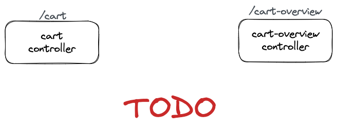

# Shopping cart 🛒

An example [CQRS](https://martinfowler.com/bliki/CQRS.html)
and [Event sourcing](https://martinfowler.com/eaaDev/EventSourcing.html) application on [Nestjs](https://nestjs.com)
framework.

### Scaffolding

TODO

### Todo

Next steps

- Rabbit bus implementation
    - [ ] Quorum queue by default
    - [ ] ConfirmChannel e waitForConfirms
    - [ ] Outbox pattern
    - [ ] Dead letter queue
    - [ ] persistent message

- General
    - [ ] Aggregate version class
    - [ ] Domain trace
    - [ ] Id class (stripe style)
    - [ ] Command bus
    - [ ] healthz endpoint

- Repo
    - [ ] Write model (check version on insert/update)
    - [ ] Aggregate events

### Run locally

Run with `env-cmd -f .local.env npm run start:dev`

---

## Serverless

- Run locally with `serverless offline`
